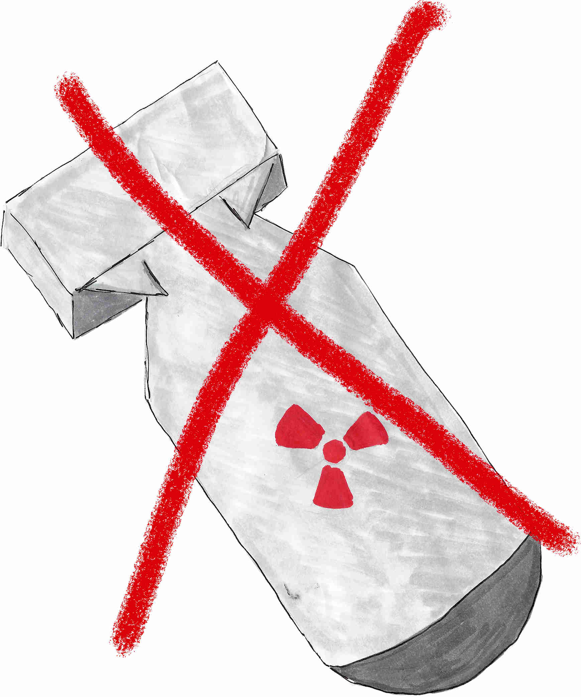

# nu.clear.lu

_English version [available here](README.md)_.

_nu.clear.lu_ ass e Projet, deen de Public iwwert Atomwaffen informéiere well.
All Informatiounen sinn op Lëtzebuergesch an/oder op Englesch.

Dëse Repository enthält Informatiounen a Quellen zu Posts op dem [nu.clear.lu Instagramaccount](TODO INSERT LINK).

## Struktur
- `creativecommons-icons/` enthält [Creative Commons](https://creativecommons.org/)-Symboler, déi genotzt ginn fir d'Lizenz a Kuerzform unzeginn.
- `raphaelsilva-instagram-icons/` enthält Instagram-Piktogrammer, déi vum [Raphael Silva, pixabay.com](https://pixabay.com/users/raphaelsilva-4702998/) erstallt goufen.
